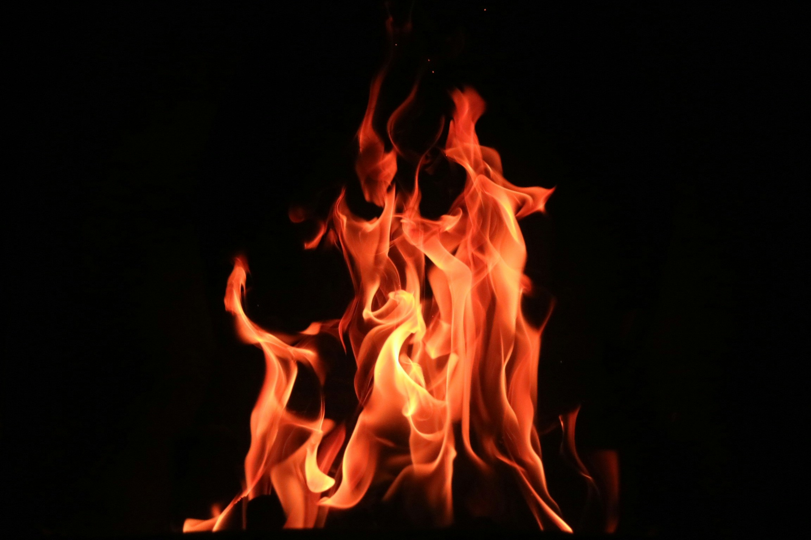

# Course Overview (Main Title)

This course teaches complete beginners how to safely make a fire outdoors.

The course is structured into sections.  
Each section contains lectures, activities, and hands-on tasks.

## Section-1_Preparation

...

## Section-2_Wood-Collection

...

## Section-3_Fire-Making

...

## Section-4_Course-Review

...